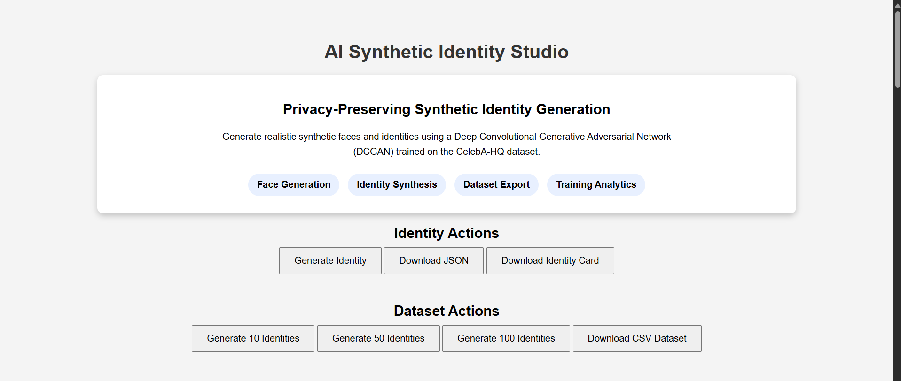
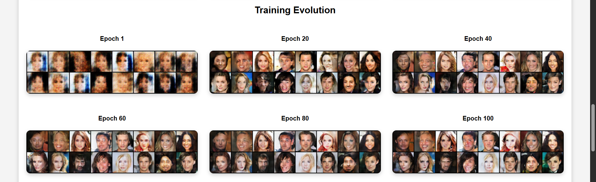
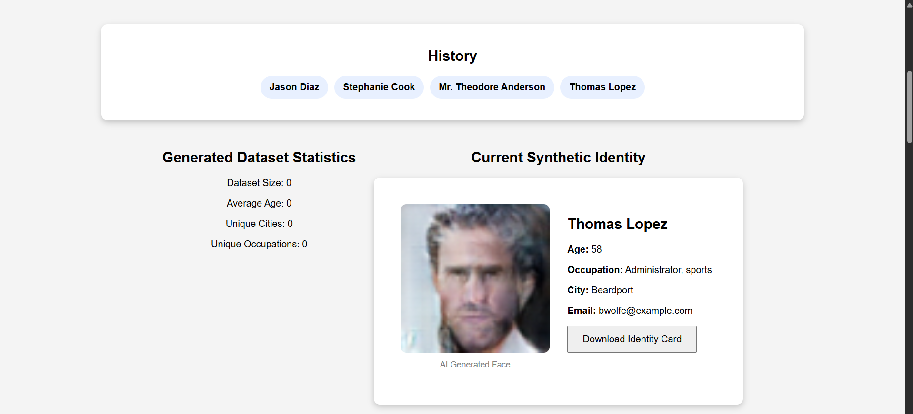
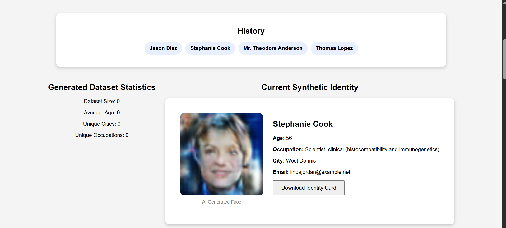
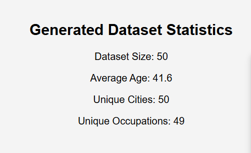
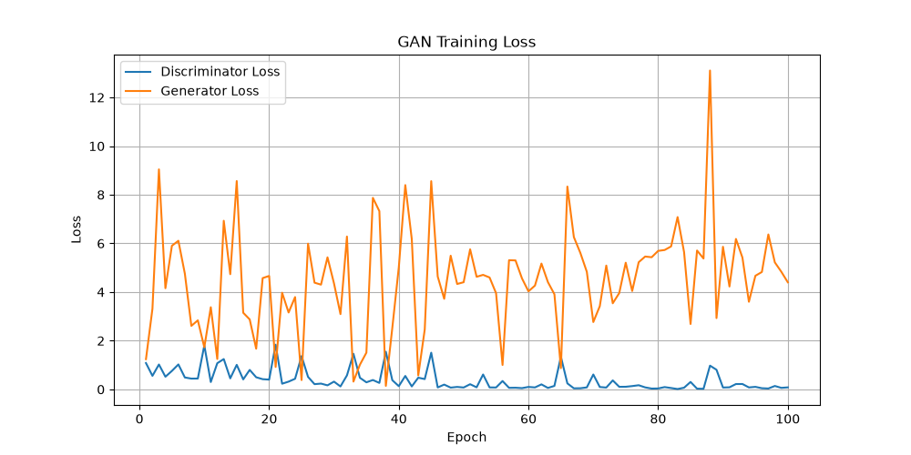

# AI Synthetic Identity Studio

## Overview

AI Synthetic Identity Studio is a full-stack machine learning application that generates realistic synthetic human identities using a Deep Convolutional Generative Adversarial Network (DCGAN).

The system combines AI-generated face images with synthetic demographic information to create privacy-preserving identities that can be used for:

- Software Testing
- UI/UX Prototyping
- Machine Learning Research
- Educational Demonstrations
- Synthetic Dataset Generation

No real personal information is used or stored.

---

## Problem Statement

Real-world identity datasets contain sensitive personal information and are often restricted due to privacy regulations.

This project generates realistic synthetic identities that can be safely used for:

- Software Testing
- UI/UX Prototyping
- Machine Learning Experiments
- Educational Demonstrations
- Privacy-Preserving Research

---

## Features

### Synthetic Face Generation

- DCGAN-based face generation
- Trained on the CelebA-HQ dataset
- Generates unique synthetic human faces

### Identity Synthesis

- Faker-based demographic generation
- Name
- Age
- Occupation
- City
- Email

### Dataset Generation

- Generate 10 / 50 / 100 identities
- Dataset statistics dashboard
- CSV export

in a single click.

### Export Options

- JSON Export
- CSV Dataset Export
- Identity Card Export

### History Tracking

- Stores previously generated identities
- Allows reloading older identities


### Training Analytics

- GAN loss visualization
- Epoch evolution gallery
- Model performance dashboard
- Training pipeline visualization

---

## Machine Learning Pipeline

### Dataset

CelebA-HQ Dataset

- ~30,000 facial images
- Preprocessed to 64×64 resolution

### Model

Deep Convolutional Generative Adversarial Network (DCGAN)

Components:

- Generator Network
- Discriminator Network

### Training Configuration

| Parameter | Value |
|------------|------------|
| Dataset | CelebA-HQ |
| Resolution | 64 × 64 |
| Epochs | 100 |
| Device | CPU |
| Training Time | ~18 Hours |

---

## System Architecture

CelebA-HQ Dataset
↓
DCGAN Training
↓
Synthetic Face Generation
↓
Faker Profile Generation
↓
Synthetic Identity Creation
↓
CSV / JSON Export

---

## Training Results

The model progressively learns facial structure and visual realism across training epochs.

Training progression:

- Epoch 1 → Noise
- Epoch 20 → Basic facial structure
- Epoch 40 → Recognizable faces
- Epoch 60 → Improved realism
- Epoch 80 → Stable face generation
- Epoch 100 → Final model

The application includes:

- Training Evolution Gallery
- Generator vs Discriminator Loss Graph

for visual analysis of model performance.

---

## Screenshots

### Homepage



### Training Evolution



### Generated Identites




### Statistic after generating 50 Datasets



### GAN Loss Graph



## Architecture


---

## Technology Stack

### Machine Learning

- PyTorch
- TorchVision
- NumPy
- Matplotlib

### Backend

- FastAPI
- Faker

### Frontend

- HTML
- CSS
- JavaScript

### Version Control

- Git
- GitHub

---

## Project Structure

```text
backend/
    app.py
    generate_face.py

frontend/
    index.html
    style.css
    script.js

training/
    generator.py
    discriminator.py
    train.py
    dataset.py

analytics/
    loss_graph.py
    loss_graph.png

generated_faces/
generated_identities/

models/
```

---

## How To Run

### Clone Repository

```bash
git clone <repository-url>
cd AI-Synthetic-Identity-Studio
```

### Install Dependencies

```bash
pip install -r requirements.txt
```

## Running Locally

### Backend

```bash
uvicorn backend.app:app --reload
```

### Frontend

Open:

```text
frontend/index.html
```

## Sample Workflow

1. Generate a synthetic identity
2. View generated face and profile
3. Save identity as JSON
4. Generate datasets in bulk
5. Export CSV datasets
6. Explore training analytics

---

## Future Improvements

- Higher resolution GAN training
- StyleGAN integration
- Cloud deployment
- User authentication
- Synthetic identity quality scoring
- Real-time training monitoring

---

## Future Improvements

- StyleGAN2 Integration
- Higher Resolution Generation
- Attribute-Controlled Face Generation
- Docker Deployment
- Cloud Hosting

---

## Author

Arunima

AI / Machine Learning Portfolio Project